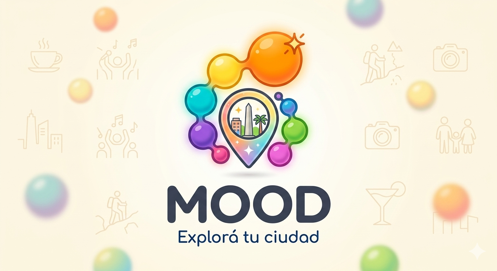

<div align="center">

</div>

# Mood App 🎭

> **Prototype — Work in Progress**

A full-stack web application that recommends nearby events based on how you're feeling. Tell the app your current mood, and it surfaces local events that match your vibe.

🌐 **Live demo:** [prototipomood.jesrepresentaciones.com.ar](https://prototipomood.jesrepresentaciones.com.ar)

---

## Features

- 🔐 User registration and login
- 😊 Mood selection to reflect how you're feeling
- 📍 Nearby event recommendations based on your current mood
- 🗄️ Persistent user data with MariaDB

---

## Tech Stack

| Layer | Technology |
|-------|-----------|
| Front-End | React, TypeScript, Tailwind CSS, Node.js |
| Back-End | FastAPI (Python) |
| Database | MariaDB |
| Containerization | Docker, Docker Compose |
| Proxy | Nginx |

---

## Getting Started

### Info

- There may be missing files because of private info and api-keys

### Prerequisites

- Python 3.9+
- Node.js 18+
- Docker & Docker Compose (recommended)
- MariaDB (if not using Docker)

### Quick Start (Docker)

```bash
git clone https://github.com/OrdinalDragon/Mood.git
cd Mood
cp .env.docker .env
docker-compose up

### Installation

1. **Clone the repository**
   ```bash
   git clone https://github.com/OrdinalDragon/mood-app.git
   cd mood-app
   ```

2. **Set up the database**
   ```bash
   # Create the database in MariaDB
   mysql -u root -p < database/schema.sql
   ```

3. **Configure environment variables**
   ```bash
   cp .env.example .env
   # Edit .env with your DB credentials and any API keys
   ```

4. **Install back-end dependencies**
   ```bash
   pip install -r requirements.txt
   ```

5. **Install front-end dependencies**
   ```bash
   npm install
   ```

6. **Run the app**
   ```bash
   # Start the back-end
   python app.py

   # In a separate terminal, start the front-end
   npm run dev
   ```

7. Open your browser at `http://localhost:3000`

---

## Project Status

This project is currently a **prototype**. Features are being actively developed and improved.

Planned improvements:
- [ ] Geolocation integration for automatic nearby detection
- [ ] Expanded mood categories
- [ ] Event detail pages
- [ ] Mobile-responsive polish

---

## Author

**Mood team (group of 9)**
**Nicolas Schernetzki**

---

## License

This project is proprietary. All rights reserved. You may view the code for reference purposes, but you may not copy, modify, or distribute it without explicit permission.
