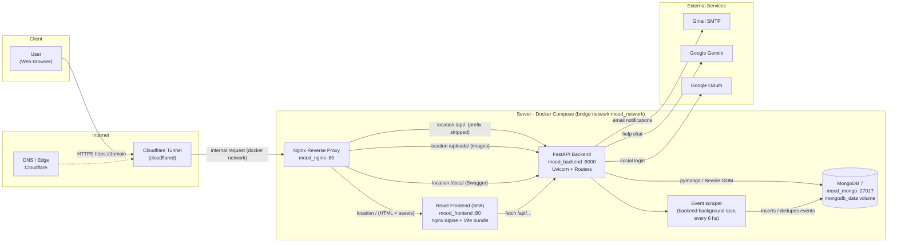
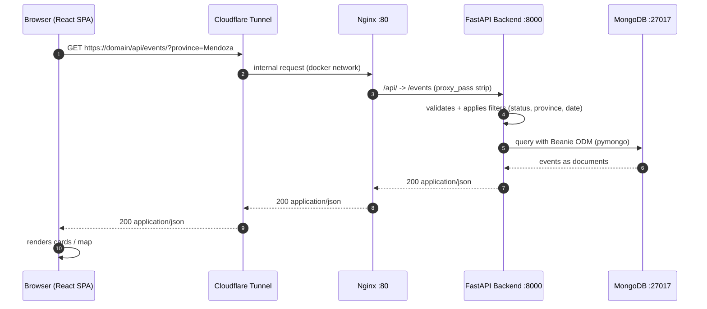

# Architecture - MOOD

Diagram showing how a request travels from the client into the infrastructure, and how information flows between services.

## Deployment view (request flow)

## Sequence of a GET /api/events request

## Route mapping (nginx.conf)

| Public URL | Internal target | Serves |
|---|---|---|
| `/` | `mood_frontend:80` | React SPA (index.html + `/assets/` bundles) |
| `/api/*` | `mood_backend:8000/*` | FastAPI REST API (auth, events, upload, gemini, favorites, ads, notifications, reviews, analytics) |
| `/uploads/*` | `mood_backend:8000/uploads/*` | event images (static) |
| `/docs/*` | `mood_backend:8000/docs/*` | Swagger UI |

## Public host ports

| Port | Service | Purpose |
|---|---|---|
| `80` | `mood_nginx` | single traffic entry point (proxy + SPA) |
| `8000` | `mood_backend` | direct API (health, docs, debug) |
| `27017` | `mood_mongo` | MongoDB (not exposed externally in production) |

## Backend background tasks (app/main.py lifespan)

- `scrape_loop`: every 6 hs, consumes external event sources (30-day window), normalizes provinces/geocodes and inserts events into MongoDB.
- `notification_scan_loop`: detects events within 7 days and sends emails (Gmail SMTP).
- `favorite_email_flush_loop`: periodic flush of favorite-event emails.