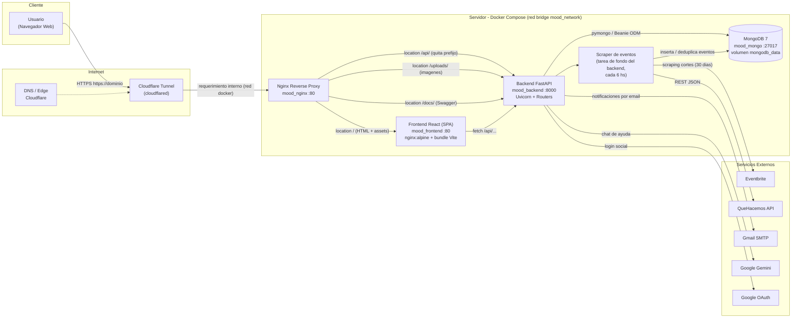
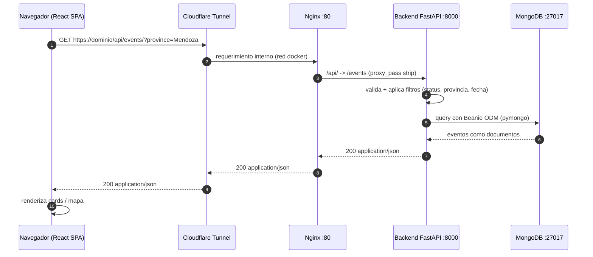

# Arquitectura - MOOD

Diagrama de como viaja una peticion desde el cliente hacia la infraestructura, y como fluye la informacion entre los servicios.

## Vista de despliegue (flujo de una peticion)

## Secuencia de una peticion GET /api/events

## Como se enrutan las rutas (nginx.conf)

| URL publica | destino interno | que sirve |
|---|---|---|
| `/` | `mood_frontend:80` | SPA React (index.html + bundles `/assets/`) |
| `/api/*` | `mood_backend:8000/*` | API REST FastAPI (auth, events, upload, gemini, favorites, ads, notifications, reviews, analytics) |
| `/uploads/*` | `mood_backend:8000/uploads/*` | imagenes de eventos (static) |
| `/docs/*` | `mood_backend:8000/docs/*` | Swagger UI |

## Puertos host visibles

| Puerto | servicio | uso |
|---|---|---|
| `80` | `mood_nginx` | entrada unica de trafico (proxy + SPA) |
| `8000` | `mood_backend` | API directa (health, docs, debug) |
| `27017` | `mood_mongo` | MongoDB (no expuesta al exterior en produccion) |

## Tareas de fondo del backend (app/main.py lifespan)

- `scrape_loop`: cada 6 hs, consume Eventbrite + QueHacemos (ventana 30 dias), normaliza provincias/geocode e inserta eventos en MongoDB.
- `notification_scan_loop`: detecta eventos a 7 dias y envia emails (Gmail SMTP).
- `favorite_email_flush_loop`: flush periodico de emails de favoritos.